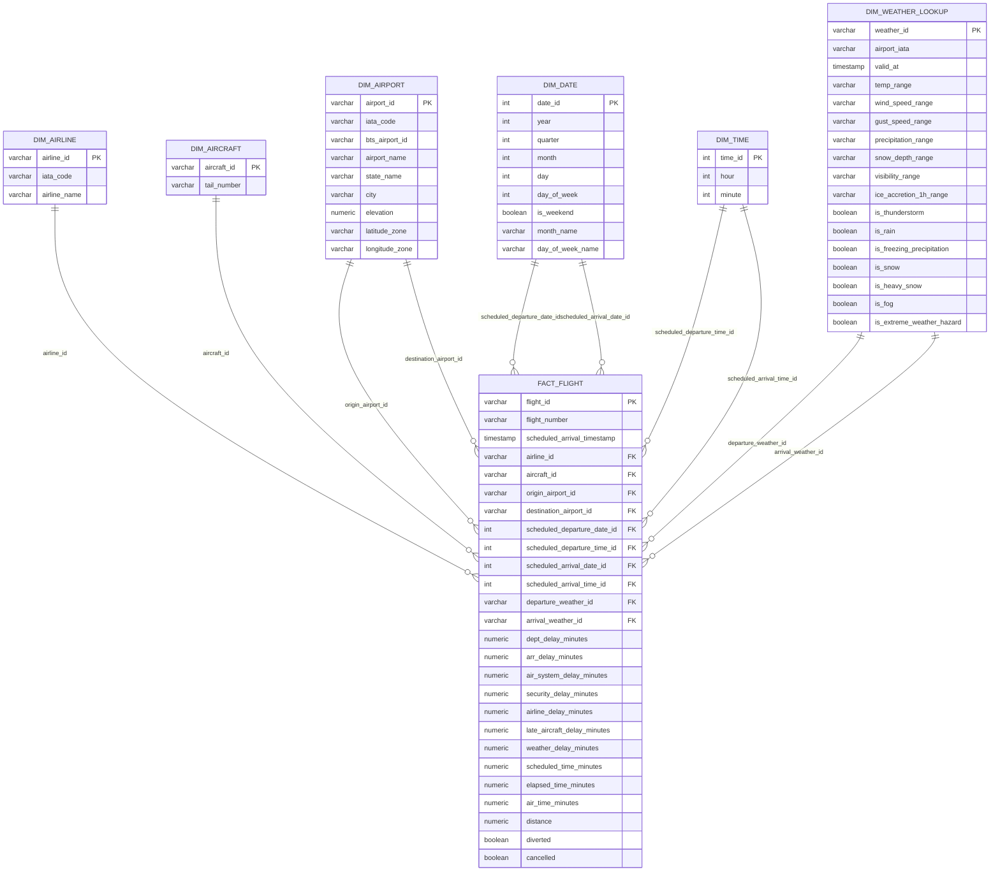

# Flights Star Schema

```mermaid
erDiagram
    FACT_FLIGHT {
        varchar flight_id PK
        varchar flight_number
        timestamp scheduled_arrival_timestamp
        varchar airline_id FK
        varchar aircraft_id FK
        varchar origin_airport_id FK
        varchar destination_airport_id FK
        int scheduled_departure_date_id FK
        int scheduled_departure_time_id FK
        int scheduled_arrival_date_id FK
        int scheduled_arrival_time_id FK
        varchar departure_weather_id FK
        varchar arrival_weather_id FK
        numeric dept_delay_minutes
        numeric arr_delay_minutes
        numeric air_system_delay_minutes
        numeric security_delay_minutes
        numeric airline_delay_minutes
        numeric late_aircraft_delay_minutes
        numeric weather_delay_minutes
        numeric scheduled_time_minutes
        numeric elapsed_time_minutes
        numeric air_time_minutes
        numeric distance
        boolean diverted
        boolean cancelled
    }

    DIM_AIRLINE {
        varchar airline_id PK
        varchar iata_code
        varchar airline_name
    }

    DIM_AIRCRAFT {
        varchar aircraft_id PK
        varchar tail_number
    }

    DIM_AIRPORT {
        varchar airport_id PK
        varchar iata_code
        varchar bts_airport_id
        varchar airport_name
        varchar state_name
        varchar city
        numeric elevation
        varchar latitude_zone
        varchar longitude_zone
    }

    DIM_DATE {
        int date_id PK
        int year
        int quarter
        int month
        int day
        int day_of_week
        boolean is_weekend
        varchar month_name
        varchar day_of_week_name
    }

    DIM_TIME {
        int time_id PK
        int hour
        int minute
    }

    DIM_WEATHER_LOOKUP {
        varchar weather_id PK
        varchar airport_iata
        timestamp valid_at
        varchar temp_range
        varchar wind_speed_range
        varchar gust_speed_range
        varchar precipitation_range
        varchar snow_depth_range
        varchar visibility_range
        varchar ice_accretion_1h_range
        boolean is_thunderstorm
        boolean is_rain
        boolean is_freezing_precipitation
        boolean is_snow
        boolean is_heavy_snow
        boolean is_fog
        boolean is_extreme_weather_hazard
    }

    DIM_AIRLINE ||--o{ FACT_FLIGHT : "airline_id"
    DIM_AIRCRAFT ||--o{ FACT_FLIGHT : "aircraft_id"
    DIM_AIRPORT ||--o{ FACT_FLIGHT : "origin_airport_id"
    DIM_AIRPORT ||--o{ FACT_FLIGHT : "destination_airport_id"
    DIM_DATE ||--o{ FACT_FLIGHT : "scheduled_departure_date_id"
    DIM_DATE ||--o{ FACT_FLIGHT : "scheduled_arrival_date_id"
    DIM_TIME ||--o{ FACT_FLIGHT : "scheduled_departure_time_id"
    DIM_TIME ||--o{ FACT_FLIGHT : "scheduled_arrival_time_id"
    DIM_WEATHER_LOOKUP ||--o{ FACT_FLIGHT : "departure_weather_id"
    DIM_WEATHER_LOOKUP ||--o{ FACT_FLIGHT : "arrival_weather_id"
```

